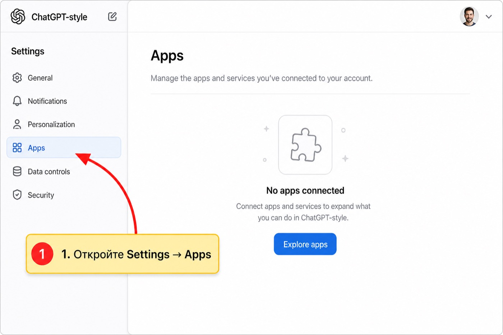
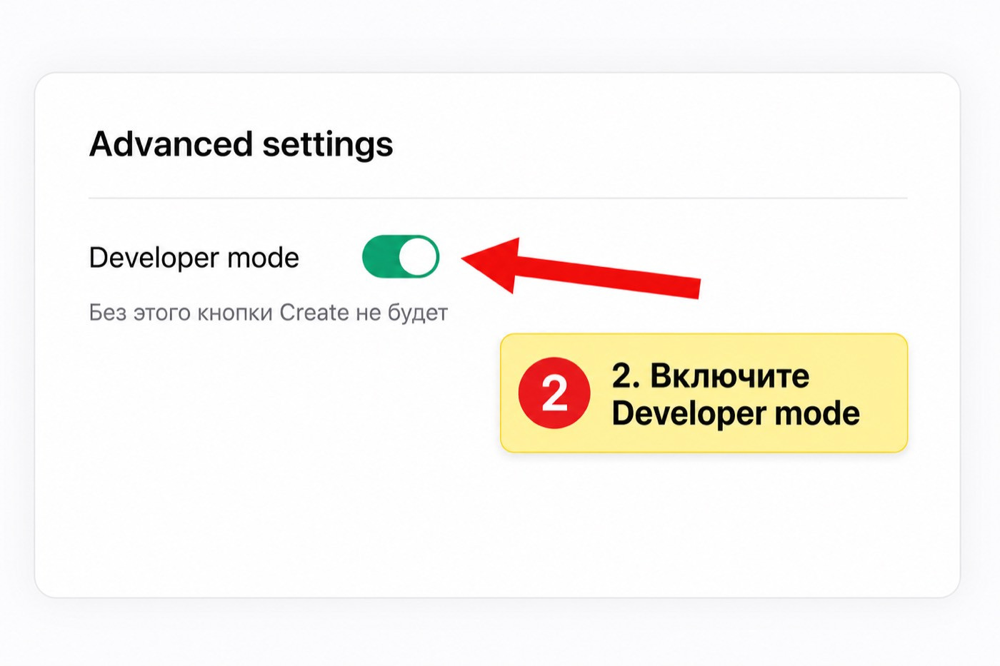
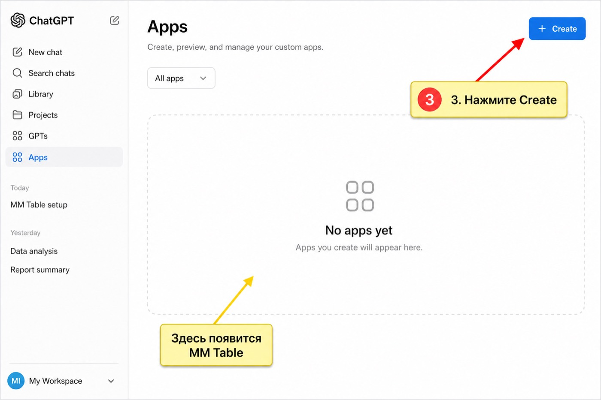
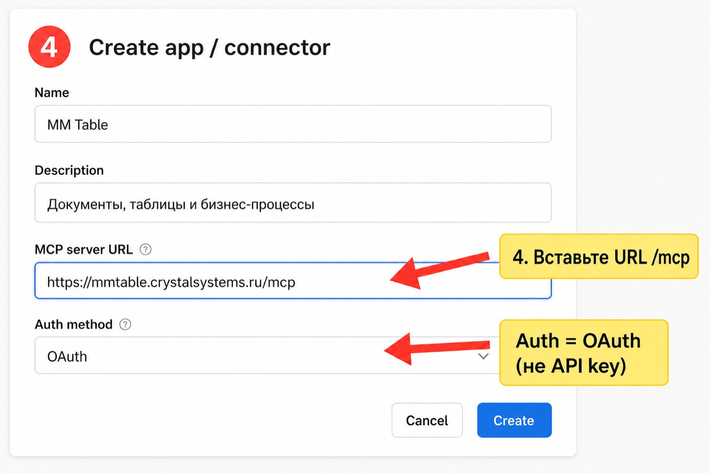
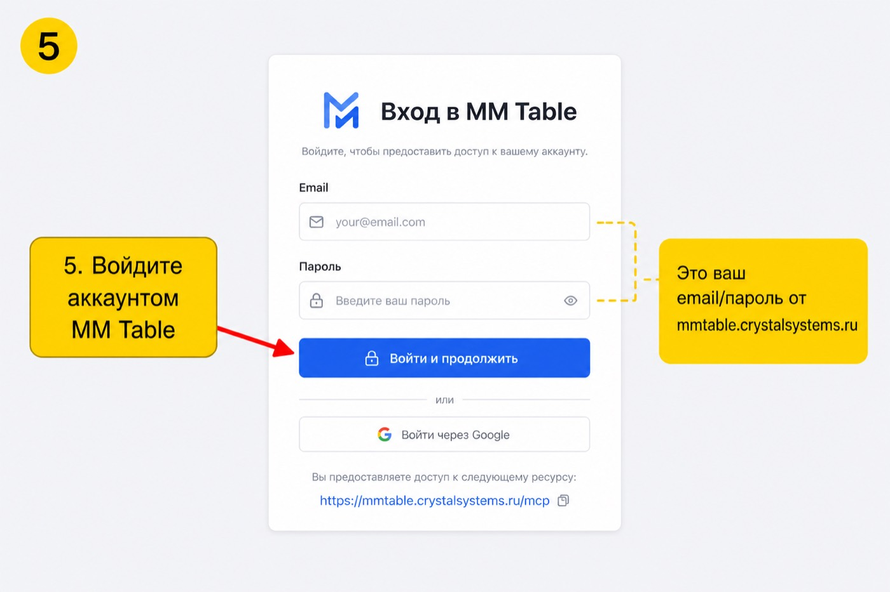
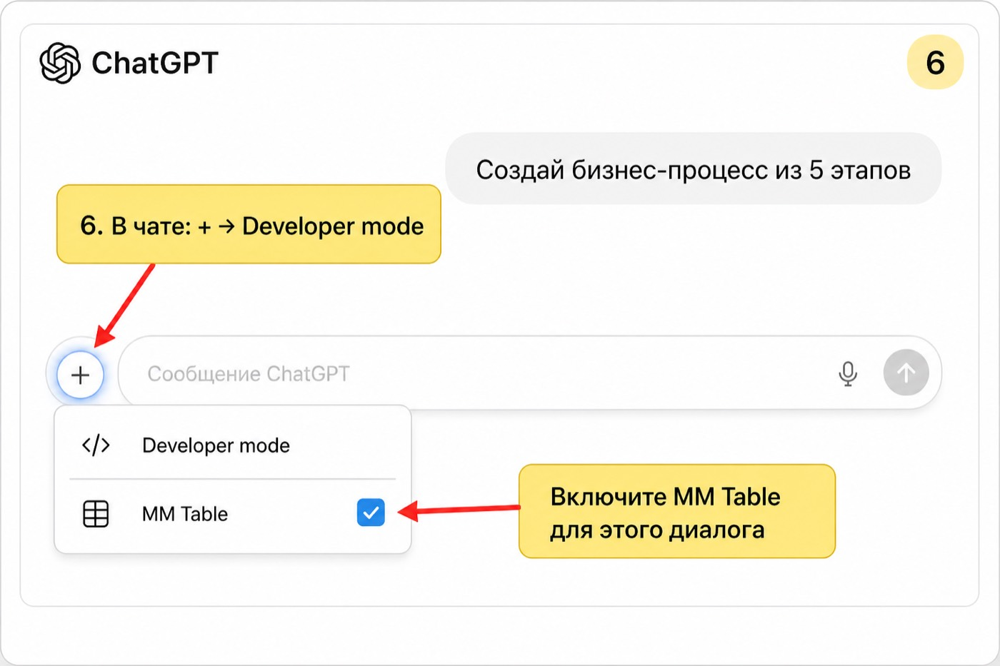

# Как подключить MM Table MCP к ChatGPT

Пошаговая инструкция со скриншотами.  
MCP URL: `https://mmtable.crystalsystems.ru/mcp`

> Нужен платный ChatGPT (Plus/Pro/Team/Business) и доступ к **Developer mode**.  
> Интерфейс ChatGPT иногда меняет названия: **Apps** / **Connectors** / **Plugins** — смысл один.

---

## Шаг 1. Откройте Apps в настройках

1. Откройте [chatgpt.com](https://chatgpt.com)
2. Нажмите на аватар → **Settings**
3. Слева выберите **Apps** (иногда **Apps & Connectors**)

---

## Шаг 2. Включите Developer mode

1. В Apps откройте **Advanced settings**
2. Включите переключатель **Developer mode**

Без этого кнопки создания своего MCP-приложения не будет.

---

## Шаг 3. Создайте app / connector

1. Вернитесь в список Apps
2. Нажмите **Create** (или **Create app**)

---

## Шаг 4. Заполните форму

| Поле | Значение |
|------|----------|
| **Name** | `MM Table` |
| **Description** | `Документы, таблицы и бизнес-процессы MM Table` |
| **MCP server URL** | `https://mmtable.crystalsystems.ru/mcp` |
| **Authentication** | **OAuth** (не API key) |

Важно:
- URL без лишнего слэша в конце: `.../mcp`
- Auth именно **OAuth** — ChatGPT сам откроет логин MM Table

Затем нажмите **Scan tools** / **Create** (как названо в вашей версии UI).

---

## Шаг 5. Войдите в аккаунт MM Table

Откроется страница OAuth MM Table:

1. Введите email и пароль от [mmtable.crystalsystems.ru](https://mmtable.crystalsystems.ru)
2. Нажмите **Войти и продолжить** / **Разрешить**

Это не пароль OpenAI — это ваш аккаунт MM Table.

После успеха ChatGPT покажет список tools (`list_documents`, `create_business_process`, …).

---

## Шаг 6. Включите MM Table в чате

В каждом новом диалоге:

1. Нажмите **+** у поля ввода
2. Выберите **Developer mode** / **More**
3. Включите **MM Table**
4. Напишите, например:  
   `Создай документ и бизнес-процесс из 5 этапов: Лид → КП → Согласование → Оплата → Закрытие`

---

## Что происходит с доступом

- Первый вход — через OAuth (логин MM Table)
- Дальше ChatGPT обновляет сессию через **refresh token** (~90 дней) без повторного логина
- Короткий access token (~1 час) обновляется автоматически

Подробнее про API и Cursor: [../MCP.md](../MCP.md)

---

## Если что-то не работает

| Симптом | Что проверить |
|---------|----------------|
| Нет Developer mode | План ChatGPT / права workspace admin |
| Нет кнопки Create | Developer mode выключен |
| Ошибка подключения URL | Точный URL `https://mmtable.crystalsystems.ru/mcp` |
| OAuth не открывается | Auth должен быть **OAuth**, не API key |
| Tools есть, но «не пишет» | Роль на документ `editor+` в MM Table |
| Нужен повторный логин | Истёк refresh (~90 дней) или доступ отозвали |

---

## HTML-версия

Откройте локально: [index.html](index.html) — та же инструкция в удобном виде для просмотра в браузере.
